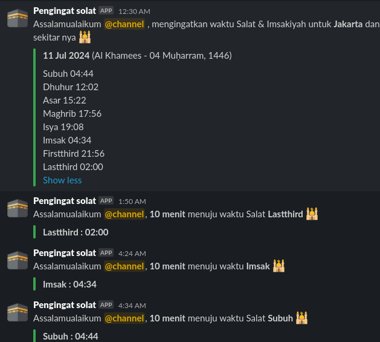

## بِسْمِ اللهِ الرَّحْمٰنِ الرَّحِيْمِ

# salat-reminder-slack

Salat Prayer Times bot for Slack integration and use API from http://api.aladhan.com

Available Calculation Methods https://aladhan.com/calculation-methods:

```
1. Muslim World League
2. Islamic Society of North America
3. Egyptian General Authority of Survey
4. Umm Al-Qura University, Makkah
5. University of Islamic Sciences, Karachi
6. Institute of Geophysics, University of Tehran
7. Shia Ithna-Ashari, Leva Institute, Qum
8. Gulf Region
9. Kuwait
10. Qatar
11. Majlis Ugama Islam Singapura, Singapore
12. Union Organization islamic de France
13. Diyanet İşleri Başkanlığı, Turkey
14. Spiritual Administration of Muslims of Russia
15. Moonsighting Committee
16. Dubai, UAE - this is not an official calculation but based on the research done by the Batoul Apps team which uses 18.2 degrees for both Fajr and Isha
17. Jabatan Kemajuan Islam Malaysia (JAKIM)
18. Tunisia
19. Algeria
20. Kementerian Agama Republik Indonesia
21. Morocco
22. Comunidate Islamica de Lisboa (Portugal)
```
Default is 20 (Kementerian Agama Republik Indonesia)

## Requirements

* Python 3
* Git
* Slack Incoming Webhook registration on your workspace at https://my.slack.com/services/new/incoming-webhook


## Setup

- Clone this repo.
```bash
cd /opt/; sudo git clone https://github.com/denzfarid/salat-reminder-slack.git
```
- Install at for schedule command and start the service
```bash
sudo yum -y install at;
sudo systemctl enable atd --now
```
- Install python pip & requests library
```bash
sudo apt install python3-pip;
pip3 install requests
```

- Edit the parameter, example:
```python
cityname = 'Jakarta'
countryname = 'Indonesia'
color = '#36a64f'
url = f'http://api.aladhan.com/v1/timingsByAddress?address={cityname},{countryname}&method=20&tune=2,2,0,4,2,4,0,2,0'
username = 'Pengingat solat'
emojicon = ':kaaba:'
webhookurl = 'https://hooks.slack.com/services/xxxx/xxxxx'
```
- Start the app with this command. NOTE that you need to have python3 installed.
```bash
$ python3 salat-times.py
```
- Setup a cron job to automate generate time every day [At 00:30](https://crontab.guru/#30_0_*_*_*). 
```
30 0 * * * python3 /opt/salat-reminder-slack/salat-times.py > /tmp/salat-times.log 2>&1

```
- Check at command job schedule
```bash
atq
```
output
```bash
10      Wed Jul 10 11:52:00 2024 a root
11      Wed Jul 10 15:12:00 2024 a root
9       Thu Jul 11 04:34:00 2024 a root
13      Wed Jul 10 18:58:00 2024 a root
12      Wed Jul 10 17:46:00 2024 a root
16      Thu Jul 11 01:50:00 2024 a root
15      Wed Jul 10 21:46:00 2024 a root
14      Thu Jul 11 04:24:00 2024 a root
```
- Delete All at queue jobs [Found article in here](https://unix.stackexchange.com/questions/53144/remove-all-at-jobs)

```bash
 for i in `atq | awk '{print $1}'`;do atrm $i;done
```

- Delete at command job schedule (if needed)
```bash
rm -rf /var/spool/at/*
```

Here's how it will look like in your channel: 

Testes using Ubuntu
